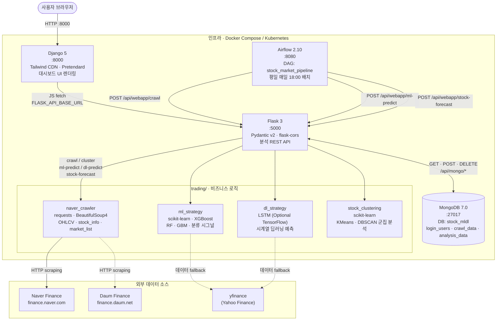
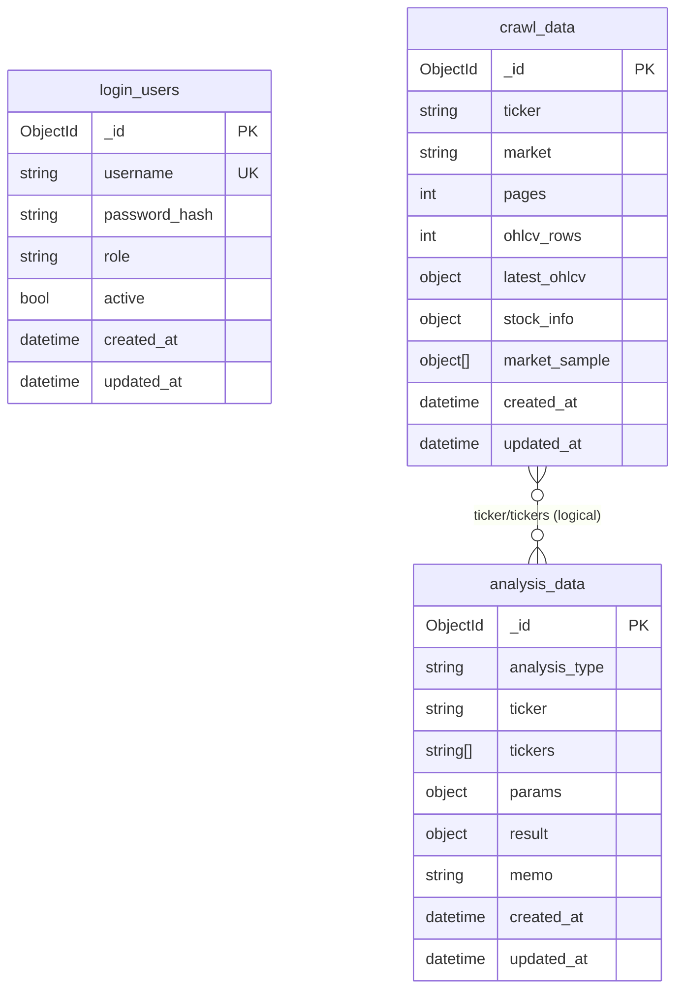

# Stock ML/DL Trading Workstation

국내 주식 크롤링, 군집화, ML/DL 예측, MongoDB 기록, Airflow 배치를 하나의 워크스테이션으로 재구성한 프로젝트입니다.

현재 메인 아키텍처는 아래처럼 나뉩니다.

- `Django`: 메인 웹앱, 템플릿 렌더링, TradingView 톤의 대시보드 UI
- `Flask`: 분석 API 및 Mongo CRUD API
- `Airflow`: 일일 크롤링/예측 배치 오케스트레이션
- `MongoDB`: 사용자, 크롤링, 분석 결과 저장소

기존 `api/` 아래 FastAPI 코드는 분석 로직과 라우트 구현 재사용을 위한 레거시 호환 레이어로 남겨두었습니다.

## 아키텍처 및 기술 스택



| 레이어 | 기술 | 역할 |
|---|---|---|
| 웹 프론트엔드 | Django 5, Tailwind CDN, Pretendard | 대시보드 UI, 템플릿 렌더링 |
| 분석 API | Flask 3, Pydantic v2, flask-cors | 크롤링·ML·DL·군집 REST API |
| 비즈니스 로직 | requests, BeautifulSoup4, scikit-learn, XGBoost, (TensorFlow) | 크롤러·ML·DL·군집 코어 |
| 데이터 저장소 | MongoDB 7.0, SQLite | 사용자·크롤링·분석 결과 영속화 |
| 배치 오케스트레이션 | Airflow 2.10 (SequentialExecutor) | 평일 일일 크롤링·예측 파이프라인 |
| 인프라 | Docker Compose, Kubernetes (k8s/) | 컨테이너 배포·서비스 구성 |
| 외부 데이터 | Naver Finance, Daum Finance, yfinance | 국내 주가·종목 정보 수집 |

## Run

### 1. Local Python Run

```bash
python -m venv .venv
source .venv/bin/activate
pip install -r requirements.txt
```

웹앱 실행:

```bash
python manage.py runserver 0.0.0.0:8000
```

Flask API 실행:

```bash
flask --app flask_api.app run --host 0.0.0.0 --port 5000 --debug
```

브라우저 접속:

- Django Web: `http://127.0.0.1:8000`
- Flask API Health: `http://127.0.0.1:5000/health`

### 2. Docker Compose

```bash
docker compose up --build
```

기본 포트:

- Django Web: `http://localhost:8000`
- Flask API: `http://localhost:5000`
- Airflow UI: `http://localhost:8080`
- MongoDB: `mongodb://localhost:27017`

Airflow 기본 계정은 로컬 개발 기준으로 `admin / admin` 입니다.

## Frontend

메인 대시보드는 Django 템플릿으로 렌더링됩니다.

- 경로: `django_app/dashboard/templates/dashboard/index.html`
- 스타일: Tailwind CDN + Pretendard
- 톤앤매너: TradingView 스타일 다크 워크스테이션

구성 요소:

- 좌측 입력/실행 패널
- 중앙 분석 카드/차트 패널
- 우측 메모/로그
- Mongo CRUD 콘솔
- Django / Flask / Mongo 상태 배지

## API

Flask API 엔드포인트:

- `GET /health`
- `POST /api/webapp/crawl`
- `POST /api/webapp/cluster`
- `POST /api/webapp/ml-predict`
- `POST /api/webapp/dl-predict`
- `POST /api/webapp/stock-forecast`

### 크롤링 데이터 실체 (실행 검증 기반)

아래는 **2026-05-14 UTC 기준으로 실제 실행한 결과**입니다.

- 실행 1: `trading.naver_crawler` 직접 호출
  - `NaverFinanceCrawler().get_daily_ohlcv("005930", pages=2)`
  - `NaverFinanceCrawler().get_stock_info("005930")`
  - `get_market_stocks("kospi", pages=1)`
- 실행 2: Flask API 호출
  - `POST /api/webapp/crawl` with `{"ticker":"005930","market":"kospi","pages":2}`

실행 환경에서 `finance.naver.com` DNS 해석이 불가해(네트워크 제한) 아래처럼 반환되었습니다.

```json
{
  "ticker": "005930",
  "pages": 2,
  "ohlcv_rows": 0,
  "ohlcv_columns": ["Date", "Open", "High", "Low", "Close", "Volume"],
  "ohlcv_dtypes": {
    "Date": "object",
    "Open": "object",
    "High": "object",
    "Low": "object",
    "Close": "object",
    "Volume": "object"
  },
  "date_min": null,
  "date_max": null,
  "latest_ohlcv": null,
  "stock_info": {
    "ticker": "005930",
    "error": "HTTPSConnectionPool(... Failed to resolve 'finance.naver.com' ...)"
  },
  "market_rows": 0,
  "market_columns": ["Name", "Ticker", "Price", "Market"],
  "market_head3": []
}
```

Flask API 레벨에서는 동일 조건에서 다음 응답을 확인했습니다.

```json
{
  "status": 404,
  "body": {
    "detail": "데이터 없음: 005930"
  }
}
```

즉, 이 프로젝트의 크롤링 데이터 실체는 다음과 같습니다.

1. **OHLCV 기본 스키마는 고정**: `Date, Open, High, Low, Close, Volume`
2. **정상 수집 시** `Date`는 datetime, 가격/거래량은 float으로 반환됨
3. **수집 실패 시(네트워크/DNS 등)** 빈 DataFrame 스키마를 유지하고 행 수(`ohlcv_rows`)는 0
4. 웹 API(`/api/webapp/crawl`)는 OHLCV가 비면 404(`데이터 없음`)를 반환
5. `stock_info`는 실패 시 `error` 필드가 포함될 수 있음

`/api/webapp/crawl` 성공 시 응답 payload 필드는 아래 구조를 사용합니다.

- `ticker`: 요청 종목코드
- `ohlcv_rows`: 수집된 일봉 행 수
- `latest_ohlcv`: 최신 1건 (`Date, Open, High, Low, Close, Volume`)
- `stock_info`: 종목 메타 정보 (`name, price, change, rate, fetched_at`)
- `market`: 요청 시장(`KOSPI`/`KOSDAQ`)
- `market_sample`: 시장 샘플 종목 배열(최대 10건)
- `mongo_id`: Mongo 저장 성공 시에만 포함

Mongo CRUD:

- `GET /api/mongo/health`
- `POST /api/mongo/users`
- `POST /api/mongo/auth/login`
- `GET /api/mongo/users`
- `GET /api/mongo/crawls`
- `GET /api/mongo/analyses`
- `DELETE /api/mongo/users/<id>`
- `DELETE /api/mongo/crawls/<id>`
- `DELETE /api/mongo/analyses/<id>`

### MongoDB Schema (BE Process)



## Airflow

Airflow DAG 위치:

- `airflow/dags/trading_pipeline.py`

현재 DAG는 다음 흐름을 가집니다.

1. 시세 크롤링
2. ML 시그널 실행
3. 일일 예측 리포트 실행

이 배치는 Flask API를 호출하는 방식으로 구성되어 있어, 웹 실행 경로와 배치 실행 경로가 동일한 비즈니스 로직을 공유합니다.

## Structure

```text
django_app/
  dashboard/
  trading_web/

flask_api/
  app.py

airflow/
  dags/
    trading_pipeline.py

api/
  routers/
  mongodb_store.py

trading/
  naver_crawler.py
  stock_clustering.py
  ml_strategy.py
  dl_strategy.py
  webapp_analytics.py
```

## Screenshots

| 화면 | 설명 |
|---|---|
|  | 초기 로드 상태 — 헤더, 상태 배지, 입력 패널 |
|  | ML 방향 예측 — RandomForest BUY 시그널 |
|  | DL 방향 예측 — MLP BUY 시그널 |
|  | 내일 주가 리포트 — 예상 밴드·시나리오 |
|  | 모바일 뷰 (390px) |

전체 스크린샷 목록: [docs/screenshots/](docs/screenshots/)

## Notes

- MongoDB는 현재 웹앱 전체의 필수 의존성은 아닙니다.
- Mongo가 내려가 있어도 Flask 분석 API는 가능한 범위에서 결과를 반환하고, 저장만 건너뜁니다.
- Airflow는 공식 `apache/airflow` 이미지를 사용하며 로컬 개발용 `standalone` 모드로 실행됩니다.
- ML·DL·Forecast 기능은 `yfinance` 소스 선택 시 Yahoo Finance 경로로 정상 동작합니다. Naver Finance 크롤링은 해당 도메인 접근이 가능한 환경에서만 수집됩니다.
