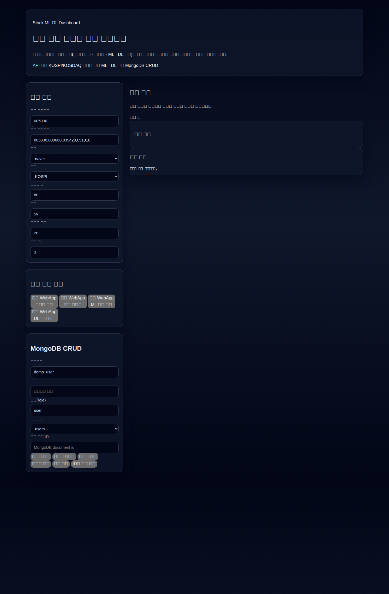
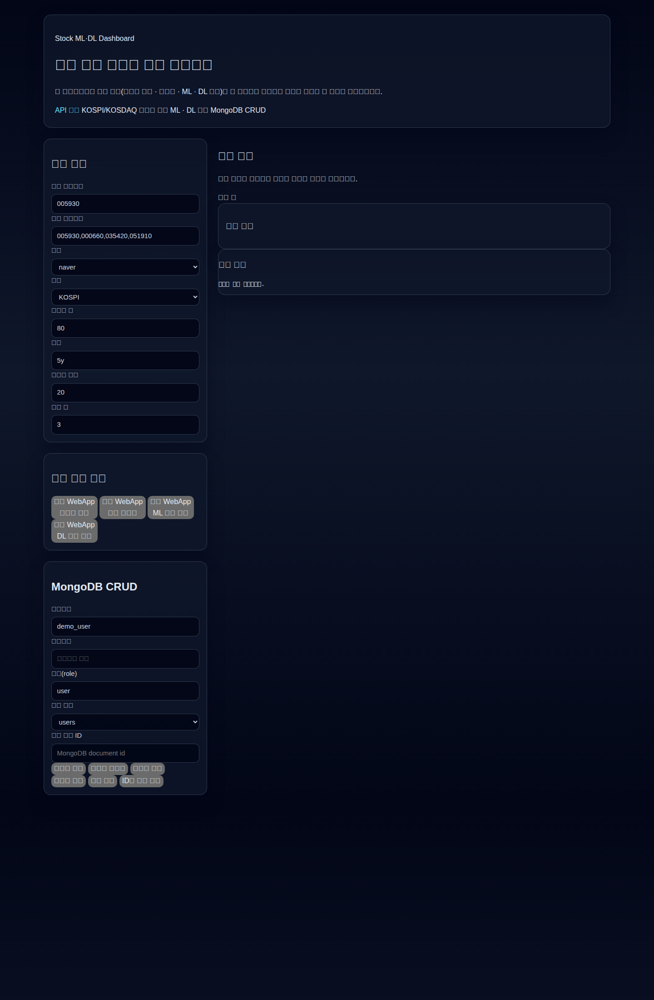
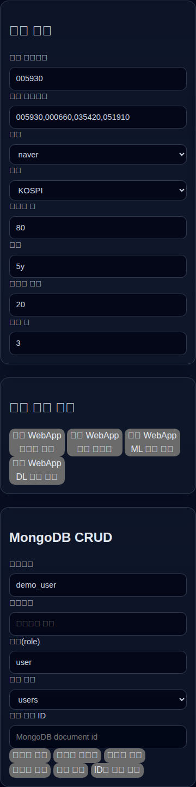
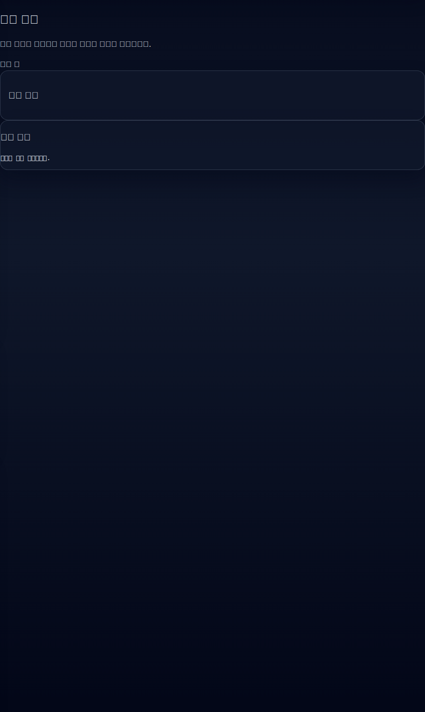
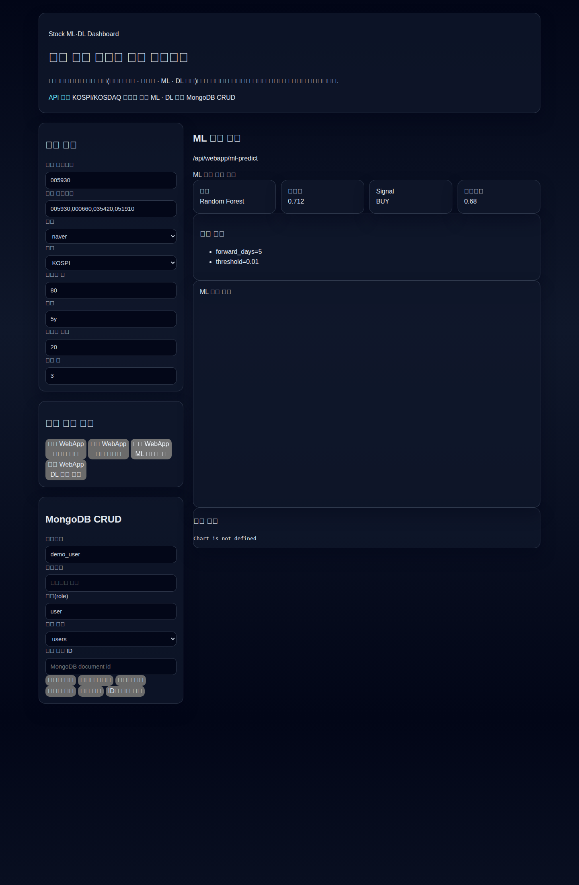
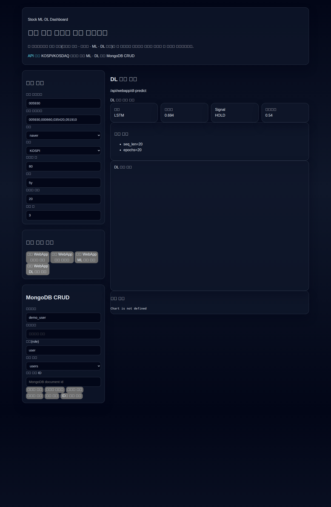
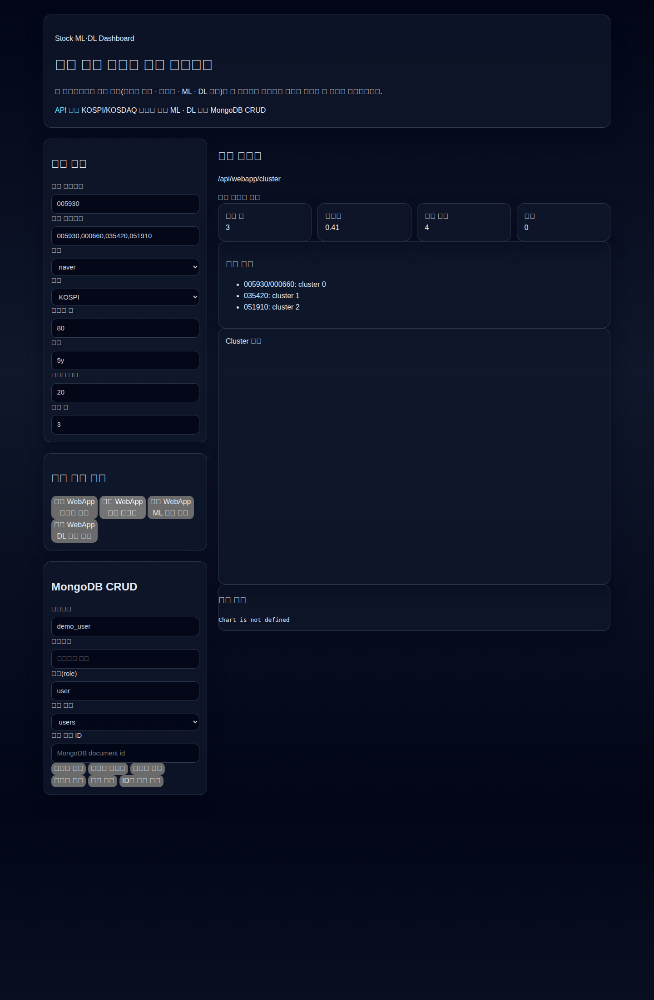
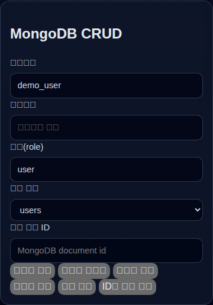
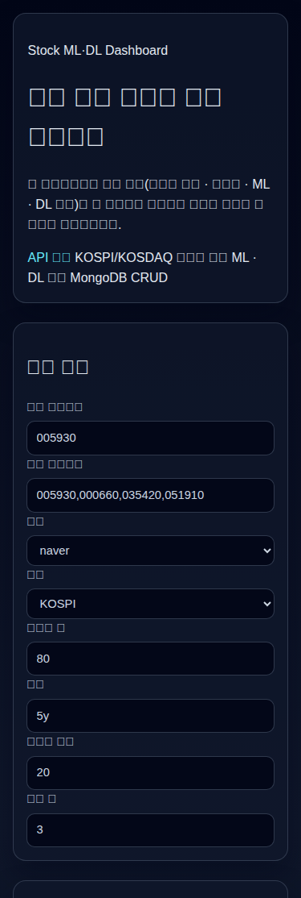

# 주가 지수 데이터 활용 머신러닝 · 딥러닝 웹앱

### 선수 - https://github.com/edumgt/investment-analysis

### 선수 - https://github.com/edumgt/python-ai-basic-lab

### 선수 - https://github.com/edumgt/python-crawling-lab


국내 증시 데이터를 활용해 아래 4단계를 웹앱 버튼으로 실행하는 FastAPI + Vanilla JS 솔루션입니다.

1. **데이터 수집**: 네이버 금융 크롤링으로 종목 OHLCV/시장 데이터 수집
2. **종목 군집화**: 수익률·변동성·모멘텀 기반 주식 군집화
3. **ML 방향 예측**: 특징 기반 머신러닝 모델 학습 및 방향성 예측
4. **DL 방향 예측**: LSTM/MLP 기반 딥러닝 학습 및 방향성 예측

---

## 실행 방법

```bash
python -m venv .venv
source .venv/bin/activate  # Windows: .venv\Scripts\activate
pip install -r requirements.txt
uvicorn api.main:app --reload --port 8000
```

브라우저 접속:
- 웹앱: http://127.0.0.1:8000/
- API 문서: http://127.0.0.1:8000/docs

---

## 웹앱 프론트엔드

- `api/static/index.html`
- **Tailwind CSS + Pretendard 폰트 + Vanilla JavaScript**
- 메인 화면에 큰 4개 버튼으로 구성

---

## 백엔드 엔드포인트 (웹앱 전용)

- `POST /api/webapp/crawl`
- `POST /api/webapp/cluster`
- `POST /api/webapp/ml-predict`
- `POST /api/webapp/dl-predict`

웹앱의 각 버튼은 위 엔드포인트를 호출하여 결과를 화면에 표시합니다.

### MongoDB CRUD 엔드포인트

- 헬스체크: `GET /api/mongo/health`
- 로그인 사용자 CRUD: `POST/GET/PUT/DELETE /api/mongo/users`
- 사용자 로그인: `POST /api/mongo/auth/login`
- 크롤링 데이터 CRUD: `POST/GET/PUT/DELETE /api/mongo/crawls`
- 분석 데이터 CRUD: `POST/GET/PUT/DELETE /api/mongo/analyses`

기본 연결 정보:
- `MONGODB_URI` (기본값: `mongodb://localhost:27017`)
- `MONGODB_DB_NAME` (기본값: `stock_mldl`)

---

## 웹앱 화면 스크린샷

> 로컬에서 `uvicorn api.main:app --port 8000` 실행 후 Playwright로 재캡처한 주요 화면 10개입니다.
> 캡처 시점마다 결과가 달라지지 않도록 액션 결과 화면(5~8)은 고정 mock 응답 기준으로 촬영했습니다.

### 1. 메인 화면 초기 상태


### 2. 전체 페이지 스크롤


### 3. 좌측 입력 패널 (공통 입력 + 액션 버튼)


### 4. 우측 결과 패널 (초기 상태)


### 5. 데이터 수집 버튼 클릭 → 로딩/결과


### 6. ML 방향 예측 결과


### 7. DL 방향 예측 결과


### 8. 종목 군집화 결과


### 9. MongoDB CRUD 섹션


### 10. 모바일 뷰 (375px)


---

## 프로젝트 구조 (핵심)

```text
api/
  main.py
  routers/
    webapp.py
    naver_crawler.py
    stock_clustering.py
    ml_strategy.py
    dl_strategy.py
  static/
    index.html

trading/
  naver_crawler.py
  stock_clustering.py
  ml_strategy.py
  dl_strategy.py
```
