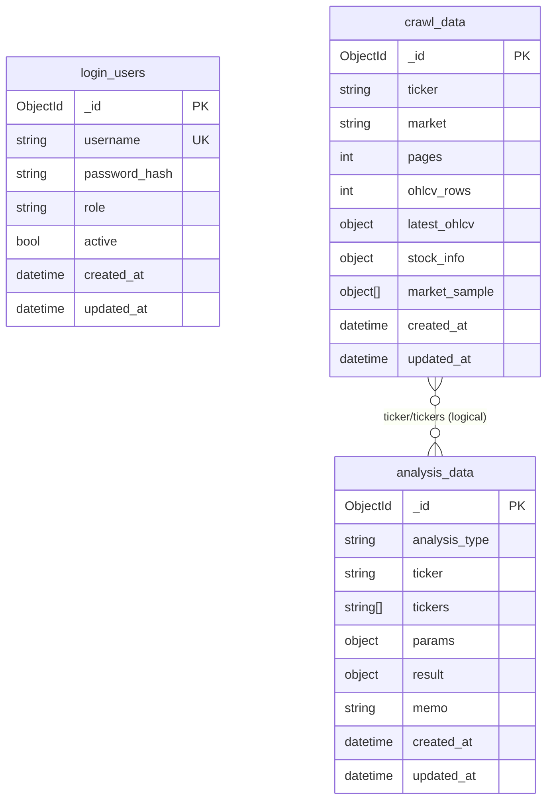

# Stock ML/DL Trading Workstation

국내 주식 크롤링, 군집화, ML/DL 예측, MongoDB 기록, Airflow 배치를 하나의 워크스테이션으로 재구성한 프로젝트입니다.

현재 메인 아키텍처는 아래처럼 나뉩니다.

- `Django`: 메인 웹앱, 템플릿 렌더링, TradingView 톤의 대시보드 UI
- `Flask`: 분석 API 및 Mongo CRUD API
- `Airflow`: 일일 크롤링/예측 배치 오케스트레이션
- `MongoDB`: 사용자, 크롤링, 분석 결과 저장소

기존 `api/` 아래 FastAPI 코드는 분석 로직과 라우트 구현 재사용을 위한 레거시 호환 레이어로 남겨두었습니다.

## Run

### 1. Local Python Run

```bash
python -m venv .venv
source .venv/bin/activate
pip install -r requirements.txt
```

웹앱 실행:

```bash
python manage.py runserver 0.0.0.0:8000
```

Flask API 실행:

```bash
flask --app flask_api.app run --host 0.0.0.0 --port 5000 --debug
```

브라우저 접속:

- Django Web: `http://127.0.0.1:8000`
- Flask API Health: `http://127.0.0.1:5000/health`

### 2. Docker Compose

```bash
docker compose up --build
```

기본 포트:

- Django Web: `http://localhost:8000`
- Flask API: `http://localhost:5000`
- Airflow UI: `http://localhost:8080`
- MongoDB: `mongodb://localhost:27017`

Airflow 기본 계정은 로컬 개발 기준으로 `admin / admin` 입니다.

## Frontend

메인 대시보드는 Django 템플릿으로 렌더링됩니다.

- 경로: `django_app/dashboard/templates/dashboard/index.html`
- 스타일: Tailwind CDN + Pretendard
- 톤앤매너: TradingView 스타일 다크 워크스테이션

구성 요소:

- 좌측 입력/실행 패널
- 중앙 분석 카드/차트 패널
- 우측 메모/로그
- Mongo CRUD 콘솔
- Django / Flask / Mongo 상태 배지

## API

Flask API 엔드포인트:

- `GET /health`
- `POST /api/webapp/crawl`
- `POST /api/webapp/cluster`
- `POST /api/webapp/ml-predict`
- `POST /api/webapp/dl-predict`
- `POST /api/webapp/stock-forecast`

Mongo CRUD:

- `GET /api/mongo/health`
- `POST /api/mongo/users`
- `POST /api/mongo/auth/login`
- `GET /api/mongo/users`
- `GET /api/mongo/crawls`
- `GET /api/mongo/analyses`
- `DELETE /api/mongo/users/<id>`
- `DELETE /api/mongo/crawls/<id>`
- `DELETE /api/mongo/analyses/<id>`

### MongoDB Schema (BE Process)



## Airflow

Airflow DAG 위치:

- `airflow/dags/trading_pipeline.py`

현재 DAG는 다음 흐름을 가집니다.

1. 시세 크롤링
2. ML 시그널 실행
3. 일일 예측 리포트 실행

이 배치는 Flask API를 호출하는 방식으로 구성되어 있어, 웹 실행 경로와 배치 실행 경로가 동일한 비즈니스 로직을 공유합니다.

## Structure

```text
django_app/
  dashboard/
  trading_web/

flask_api/
  app.py

airflow/
  dags/
    trading_pipeline.py

api/
  routers/
  mongodb_store.py

trading/
  naver_crawler.py
  stock_clustering.py
  ml_strategy.py
  dl_strategy.py
  webapp_analytics.py
```

## Notes

- MongoDB는 현재 웹앱 전체의 필수 의존성은 아닙니다.
- Mongo가 내려가 있어도 Flask 분석 API는 가능한 범위에서 결과를 반환하고, 저장만 건너뜁니다.
- Airflow는 공식 `apache/airflow` 이미지를 사용하며 로컬 개발용 `standalone` 모드로 실행됩니다.
- 기존 스크린샷은 새 Django UI 기준으로 다시 캡처하는 것이 좋습니다.
